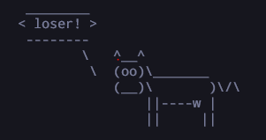
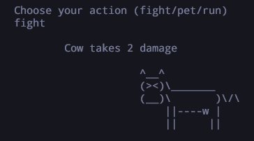
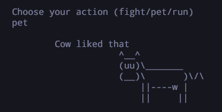

## cowfight
A rust program that lets you fight cows in the terminal. The purpose of the project was to gain more experience on using structs, enums, modules, and json files.

## Description
Have you ever wanted to fight that cow in cowsay? 

    

Well now is your chance with cowfight! In cowfight, you can experience the joy of

### FIGHTING

    

### PETTING

    

And many more!
